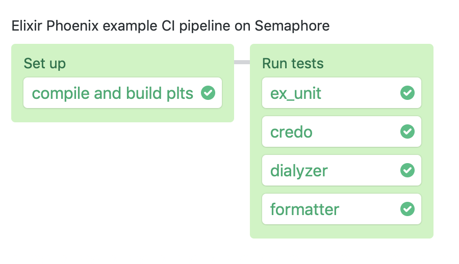

# Semaphore demo CI pipeline using Elixir and Phoenix

Example application and CI pipelien showing how to run an Elixir Phoenix project
on [Semaphore][semaphore].

## CI on Semaphore

Fork this repository and use it to [create your own project][create-project] on
Semaphore.

The CI pipeline will look like this:

The example pipeline contains 2 blocks.
The second block contains 4 parallel jobs.

1. Download dependencies, compile code.
2. Run tests
    1. [exunit tests][exunit]
    2. integration tests via [wallaby][wallaby] using headless Chrome
    3. [credo][credo] code analysis
    4. [dialyzer][dialyxir] checks

## License

Copyright (c) 2019 Rendered Text

Distributed under the MIT License. See the file LICENSE.

[semaphore]: https://semaphoreci.com
[create-project]: https://docs.semaphoreci.com/article/63-your-first-project
[exunit]: https://semaphoreci.com/community/tutorials/introduction-to-testing-elixir-applications-with-exunit
[wallaby]: https://github.com/keathley/wallaby
[credo]: https://github.com/rrrene/credo
[dialyxir]: https://github.com/jeremyjh/dialyxir
